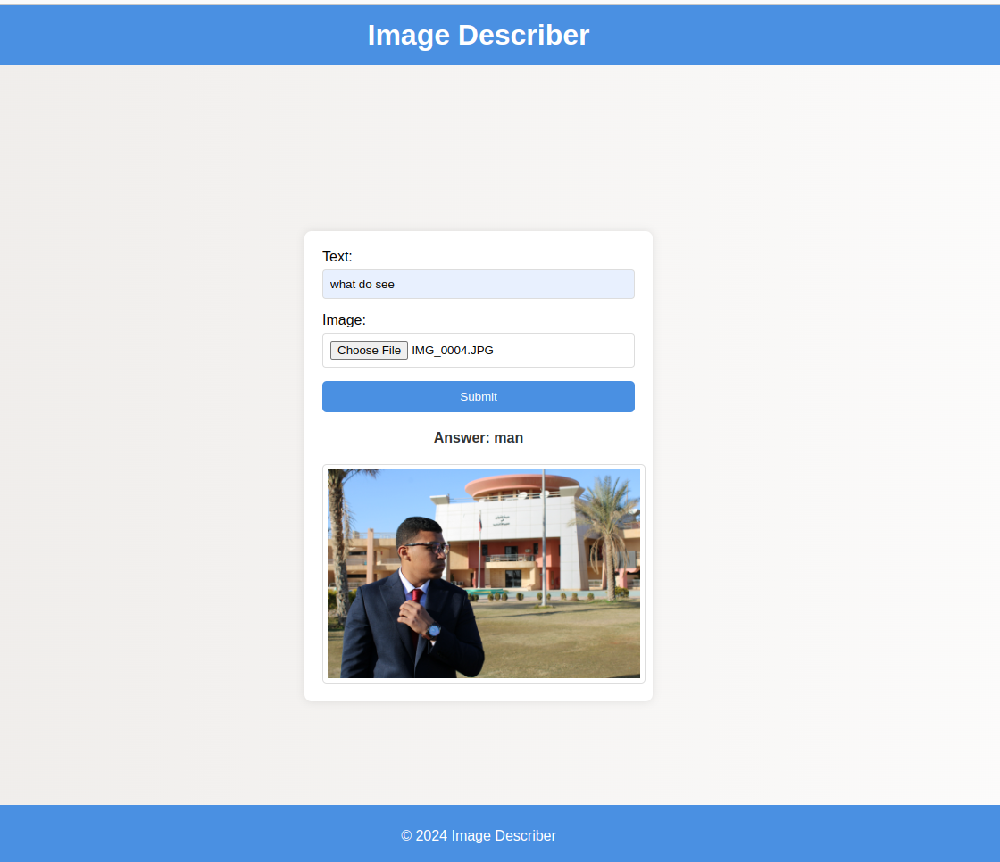

# Ask Model Application

## Overview

The Ask Model Application is a web-based interface that leverages an open-source Hugging Face model to analyze and describe images based on provided textual input. The application consists of a modern frontend interface built with HTML, CSS, and JavaScript, and a backend powered by FastAPI, a high-performance web framework for building APIs with Python 3.7+.

## Features

- **User-Friendly Interface:** A clean, modern UI with a header, footer, and central tile for easy interaction.
- **Image Preview:** Real-time image preview on upload to ensure the correct file is selected.
- **Responsive Design:** Mobile-friendly and responsive design to provide a seamless user experience across devices.
- **Fast and Efficient:** Utilizes FastAPI for handling requests quickly and efficiently.
- **Advanced Image Analysis:** Uses a state-of-the-art Hugging Face model to provide detailed descriptions of uploaded images.


## Usage

### Step 1: Create a Virtual Python Environment

First, create a new virtual environment to ensure all dependencies are isolated from your main Python installation.

```bash
conda create -n image-desc python=3.9 
```

### Step 2: Activate the Environment

```bash
conda activate image-desc
```

### Step 3: Install the Requirements

```bash
pip install -r requirements.txt
```

### Step 4: Run the app

```bash
uvicorn main:app --reload
```
### Step 5: Open the application

Paste the following url in the browser 

```bash
http://127.0.0.1:8000
```

## Demo




## Contribution
Contributions are welcome! If you find any issues or have suggestions for improvement, please create an issue or submit a pull request on the project's GitHub repository.


